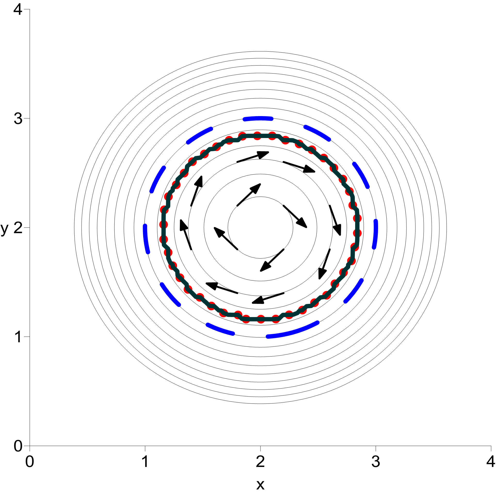

:-------------------------:|:-------------------------:
  |  

__SWE_FVM__ extensively exploits the ideas from the article [Liu et al.,2018](https://www.sciencedirect.com/science/article/pii/S0021999118304996) to build a robust positivity-preserving well-balanced interpolation of the unknown
fields.

To build the project, you will need:

* C/C++ compiler that supports the C++17 standard;
* Cmake version >= 3.8.

Simply clone this repository to your machine and run Cmake:

```
$ mkdir build
$ cd build 
$ cmake -DCMAKE_BUILD_TYPE=Debug .. # or =Release
$ make
```
You will get the executable called SWE_FVM in your _build_ directory.

Program supports the parameter input from standard .ini files. Also it is able to read .msh files provided by [Gmsh](https://gmsh.info) version >= 4.1. 

New flux discretizations, as well as time discretizations, can be added to the framework very simply.

The [Eigen](https://eigen.tuxfamily.org) library is used for algebraic operations. 

The author of the code apologizes for the amount of provided Doxygen
[documentation](https://nikitamatckevich.github.io/SWE_FVM/). It will be
detailed as soon as possible.
